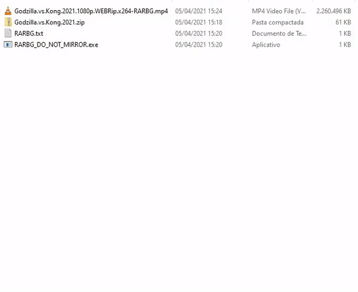

# Python Legendas TV Organizer

Program to organize subtitles downloaded from [legendas.tv](http://legendas.tv). To work, run .py in a folder with the video file and the .zip downloaded from [legendas.tv](http://legendas.tv).



### Prerequisites

What things you need to install the software and how to install them

```
Python 3.x
```

## Getting Started

These instructions will get you a copy of the project up and running on your local machine for development and testing purposes.

Start creating a virtual environment called "venv":

```
$ python -m venv venv
```

Then, activate with:

Windows:

```
$ venv\Scripts\activate
```

MacOs:

```
$ source venv/bin/activate
```

When finised, deactivate with:

```
$ deactivate
```

After activate "env" it is necessary install the requirements:

```
$ pip install -r requirements.txt
```

## Testing

For testing, use the sample video e subtitle in the forlder "test" and call the main script:
```
cd test/
python ../legendas-tv-organizer/legendas-tv-organizer.py
```

## Running

### Linux, Mac OS X, BSD and most OSes except Windows
Turn script executable:

```
chmod +x legendas-tv-organizer/legendas-tv-organizer.py
```

Call script inside a folder:

```
./legendas-tv-organizer.py .
```

### Windows

1. To run a test, call the script inside the folder.

```
python legendas-tv-organizer.py .
```

**For Windows in Context Menu:**

To generate *legendas-tv-organizer.exe* file to run on Windows.

```
pyinstaller -w -F legendas-tv-organizer/legendas-tv-organizer.py
```

2. Add the keys on Registry or run *legendas-tv-organizer.reg*.
3. Copy .exe file on *C:\Program Files\Legendas TV Organizer*
4. Add *C:\Program Files\Legendas TV Organizer* in the *Path* on Windows Environment Variable.

## Contributing

Feel free to submitting pull requests.

## Authors

* **Matheus N. S. M. de Lima** - *Initial work* - [Site](https://imanasomali.vercel.app)


## License

This project is licensed under the [GNU General Public License](https://opensource.org/licenses/GPL-3.0).

## Acknowledgments

Inspired by:

* [photo-organizer](https://github.com/gabrielfroes/photo-organizer)
* [Código Fonte TV](https://www.youtube.com/codigofontetv), Youtube Channel.